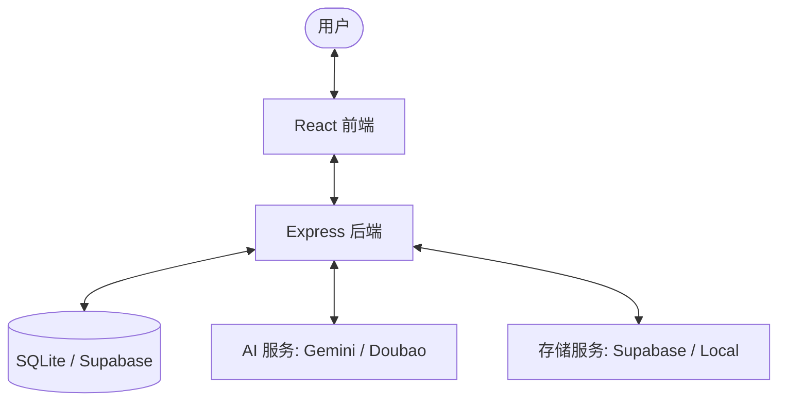

# 项目架构 (Architecture)

ClipMind 采用前后端分离的架构，旨在提供高效的视频 AI 处理能力。

## 🏗️ 整体架构

## 💻 技术栈

### 前端 (Frontend)
- **框架**: React 19 + Vite
- **状态管理**: Zustand
- **路由**: React Router 7
- **UI/样式**: Tailwind CSS + Lucide Icons
- **动画**: Framer Motion

### 后端 (Backend)
- **运行时**: Node.js
- **框架**: Express.js (TypeScript)
- **认证**: Supabase Auth (通过 `authMiddleware`)
- **数据持有**: SQLite (开发环境下使用 `better-sqlite3`)

## 🛠️ 核心模块说明

| 模块 | 说明 |
| :--- | :--- |
| **API 层** | 处理 HTTP 请求，集成中间件进行认证和错误处理。 |
| **Service 层** | 包含核心业务逻辑，如视频分析、剧本生成、抖音解析。 |
| **Repository 层** | 抽象数据访问，支持对 SQLite/Supabase 的操作。 |
| **Middleware** | 统一响应格式、JWT 验证、全局错误捕捉。 |

## 🔄 数据流向
1. 用户在前端提交一个视频 URL 或上传文件。
2. 后端接收请求，如果是 URL，则调用解析服务获取直链。
3. 后端调用 AI 服务（如 Gemini）进行内容理解。
4. 处理结果存储到数据库，并返回给前端展示。
5. 用户确认后，进入剪辑或导出环节。
